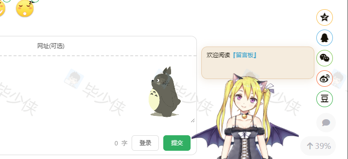

# hugo-shortcode-plugins-live2d



一个live2d版娘插件，shortcode的Hugo主题插件。
使用开源 live2d - Github 地址

## Installation

将此 git 存储库克隆到您的主题文件夹中并添加为您的网站目录的子模块。

```bash
git submodule add https://github.com/fixit-theme/hugo-shortcode-plugins-live2d.git themes/plugins-live2d
```

接下来编辑您的项目 `config.toml` 并将此主题组件添加到您的主题中：

```bash
theme = ["your-main-theme", "plugins-live2d"]
```

要了解 hugo 的主题组件以及如何使用它们，请查看 <https://gohugo.io/hugo-modules/theme-components/>。

## Usage

`plugins-live2d` shortcode 有以下命名参数：

  - **width** *[必需]*（第一个位置参数）宽度 200
  - **height** *[可选]*（第二个位置参数）高度，默认：`220`
  - **position** *[可选]*（第二个位置参数）位置，默认：`left:20` 左边距20px; 或者 `right:20` 右边距20px;
这是一个md中用法示例：

```markdown

<!-- OR -->

```

这是一个html中用法示例：

```html
{{ partial "plugin/plugins-live2d.html" (dict "width" "200" "height" "220" "position" "right:10" ) -}}
```

> **Warning** 同一页面只支持使用一次！
> 如果需要在整个网站中使用，在footer 或者 header中添加即可

## Dependencies

- [live2d](https://github.com/fghrsh/live2d_demo)
